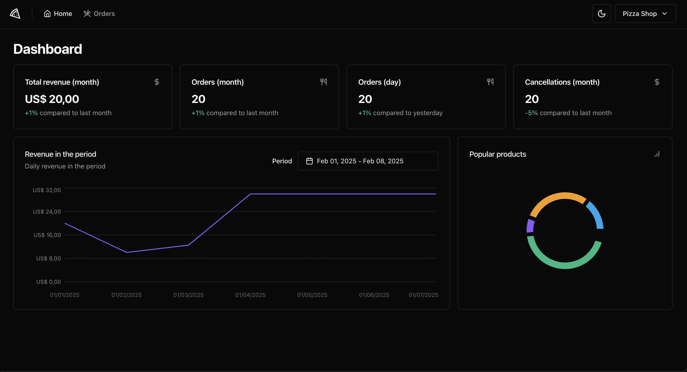
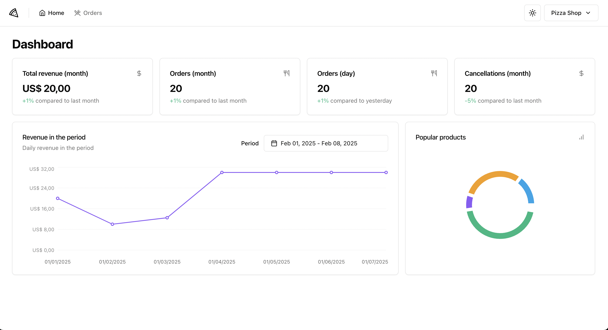
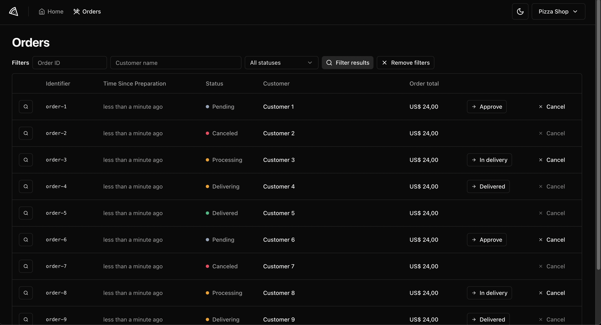
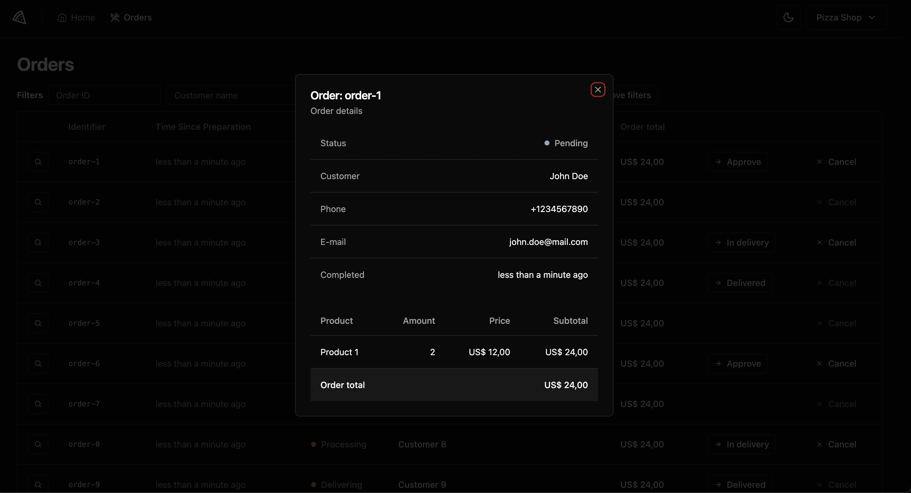
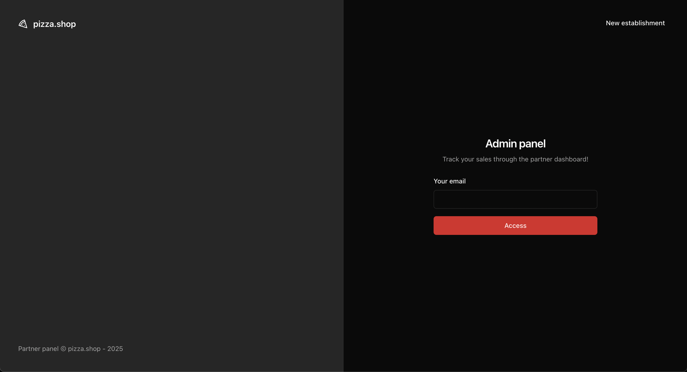
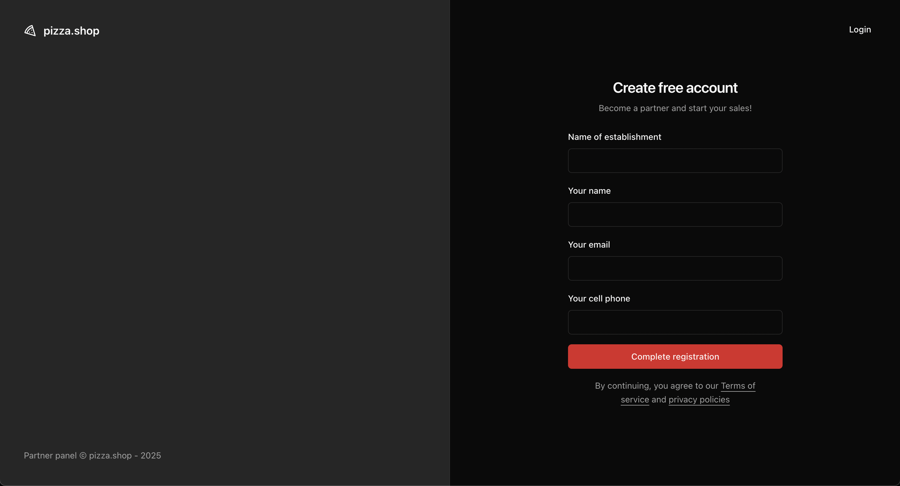
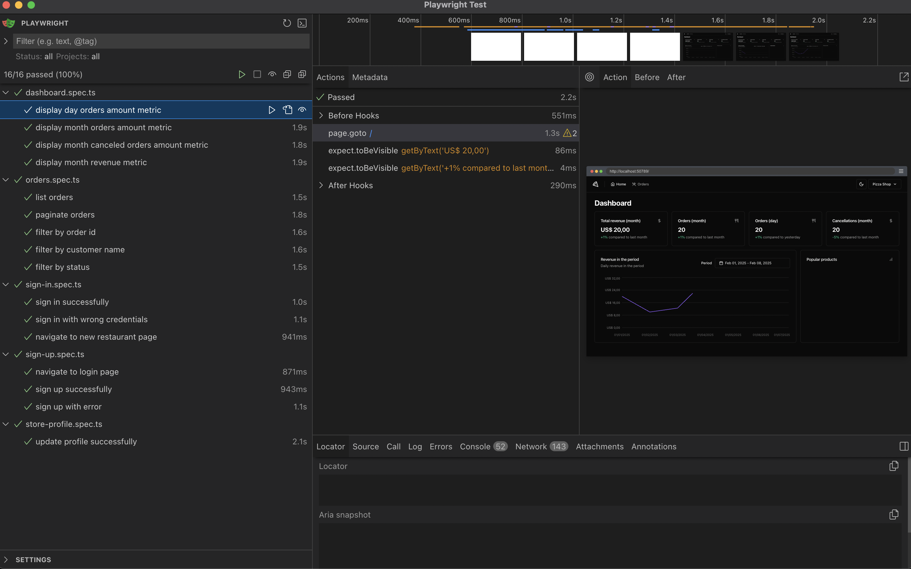

<div align="center">
   
</div>

## Overview

Welcome to the pizza.shop partner panel. This application allows partners to manage their orders and profile with ease.

## Technologies Used

- React
- TypeScript
- Tailwind CSS
- Vite
- React Query
- Axios
- Radix UI
- Zod
- Playwright (for e2e testing)

## Screenshots

### Dashboard


Light Version


### Orders Page


### Order Details


### Sign in Page


### Sign up Page


## End-to-End Testing

We use Playwright for end-to-end (e2e) testing to ensure the quality and reliability of our application. Playwright allows us to automate browser interactions and verify that our application behaves as expected.

### Running e2e Tests

To run the e2e tests, use the following command:

```bash
pnpm run test:e2e
```

This will start the Playwright test UI and execute all the e2e tests defined in the project.

### E2E

